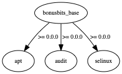

# Bonus Bits Base Cookbook
[](https://github.com/bonusbits/bonusbits_base)
[](https://circleci.com/gh/bonusbits/bonusbits_base/tree/master)
[](https://github.com/bonusbits/bonusbits_base)
[](https://gitter.im/bonusbits/bonusbits_base?utm_source=badge&utm_medium=badge&utm_campaign=pr-badge&utm_content=badge)
[](https://github.com/bonusbits/bonusbits_base/issues)

# Purpose
Chef Cookbook that will setup the basics for various flavors of Linux and Windows Servers.
Be sure to set appropriate overrides for what you do and don't want to be setup in your environment files.
This is a great starting point for all your nodes. It's also a great example for writing wrapper cookbooks.

The secondary purpose of this cookbook is to give various examples that can be replicated in other cookbooks. I did my best to include all the major coding and testing scenarios.

# Supported Platforms
At least temporarily I've focused only ona Amazon Linux. I have not tested all the other flavors since v2.0.0 release.
I plan to work through the other distros over time.
* Linux
    * Amazon (EC2 Only)
    * RHEL 6/7 (EC2 Only) **Not Fully Tested**
    * CentOS 6/7 **Not Fully Tested**
    * Ubuntu 14/16 **Not Fully Tested**
* Windows (EC2 Only - WIP) **May Never Get Around to Winderz**
    * 2012 R2
    * 2016

# Successfully Tested Versions
| Software | Version |
| :--- | :--- |
| Mac OSX | 10.12.4 |
| Docker | 17.03.1-ce, build c6d412e |
| Chef Development Kit | 1.6.1 |
| Chef-client | 12.21.4 |


# Attributes
| Section          | Attribute                                          | Default                                                                                        | Type    | Description                                                        |
| :--------------- | :------------------------------------------------- | :------                                                                                        | :------ | :----------------------------------------------------------------- |
| Audit            | bonusbits_base:audit:configure                     | false                                                                                          | Boolean | only when deployed with dockerfile                                 |
| AWS              | bonusbits_base:aws:inside                          | false                                                                                          | Boolean | discovery toggles this                                             |
| AWS              | bonusbits_base:aws:install_tools                   | false                                                                                          | Boolean | Install aws cli on other none Amazon Linux OSs                     |
| AWS              | bonusbits_base:aws:region                          | N/A                                                                                            | String  | Used Ohai EC2 Plugin to Discover, but optional overriding this way |
| Bash Profile     | bonusbits_base:bash_profile:configure              | true                                                                                           | Boolean | Add a few minor profile customizations                             |
| Certs            | bonusbits_base:certs:configure                     | false                                                                                          | Boolean | Enable deployment of Internal/Other CA Certificates                |
| Certs            | bonusbits_base:certs:data_bag                      | bonusbits_base                                                                                 | String  | Data Bag Name (Folder) that contain Certificate Data Bag Item      |
| Certs            | bonusbits_base:certs:data_bag_item                 | internal_ca                                                                                    | String  | Data Bag Item (JSON) that contain CA Certificate PEM & HASH        |
| CloudWatch Logs  | bonusbits_base:cloudwatch_logs:configure           | true                                                                                           | Boolean | Enable AWS CloudWatch Logs Agent Installation and configuration    |
| CloudWatch Logs  | bonusbits_base:cloudwatch_logs:deploy_logs_conf    | true                                                                                           | Boolean | Deploy log streams configuration. Disable if have custom log streams in your wrapper |
| CloudWatch Logs  | bonusbits_base:cloudwatch_logs:logs_group_name     | kitchen-bonusbits-base                                                                         | String  | Name of CloudWatch Logs Log Group. Override in CloutFormation with created group name |
| Default          | run_state:detected_environment                     | dev                                                                                            | String  | Determine if actual environment is dev, qa, stg or prd based on Chef Environment name       |
| Default          | bonusbits_base:deployment_type                     | N/A                                                                                            | String  | Determine if deployment type is docker, lxc, lxd, kvm, vbox, ec2 or other using Ohai and Discovery Library   |
| Default          | bonusbits_base:deployment_location                 | N/A                                                                                            | String  | Determine if deployment local is circleci, aws or local using Env var and Discovery Library   |
| Default          | bonusbits_base:deployment_method                   | N/A                                                                                            | String  | Determine if deployment method is kitchen, cloudformation, dockerfile, dockerimage or unknown   |
| Epel             | bonusbits_base:epel:configure                      | false                                                                                          | Boolean | Enable Setup of EPEL Repo   |
| Epel             | bonusbits_base:epel:install_packages               | false                                                                                          | Boolean | Install Package list from EPEL Repo   |
| Gem Source       | bonusbits_base:gem_source:configure                | false                                                                                          | Boolean | Enable System and Chef Ruby Gem Source replacement with say an internal repo   |
| Gem Source       | bonusbits_base:gem_source:source_url               | https://artifactory.localdomain.com/artifactory/api/rubygems/                                  | String  | Source Ruby Gem Repo URL to replace rubygems.org. This is a bogus example URL   |
| Gem Source       | bonusbits_base:gem_source:source_url               | https://artifactory.localdomain.com/artifactory/api/rubygems/                                  | String  | Source Ruby Gem Repo URL to replace rubygems.org. This is a bogus example URL   |
| Kitchen Shutdown | bonusbits_base:kitchen_shutdown:configure          | *true                                                                                          | Boolean | Enable creation of crontab to shutdown and terminate an AWS EC2 instance deployed by kitchen. *If an EC2 instance and deployed with Kitchen then the default is 'true'.  |
| Kitchen Shutdown | bonusbits_base:kitchen_shutdown:minute             | 0                                                                                              | String  | Crontab minute to run |
| Kitchen Shutdown | bonusbits_base:kitchen_shutdown:hour               | 6                                                                                              | String  | Crontab hour to run. Default is 7AM UTC = 11PM PST/2AM EST. Cron runs on whatever the timezone is set on system. Default example based on UTC |
| Node Info        | bonusbits_base:node_info:configure                 | true                                                                                           | Boolean | Deploy a Bash/Batch Shell Script that can be used to quickly display information about the local system. Script deployed to standard system path locations: Linux **/usr/local/bin/nodeinfo** Windows **C:/Windows/System32/nodeinfo.cmd** |
| Packages         | bonusbits_base:packages:install                    | true                                                                                           | Boolean | Install a set of basic packages |
| Packages         | bonusbits_base:packages:update                     | true                                                                                           | Boolean | Update all but kernel packages on system |
| Packages         | bonusbits_base:packages:amazon:packages            | [List Here](https://github.com/bonusbits/bonusbits_base/blob/master/attributes/packages.rb)    | Array   | List of Amazon Linux Packages |
| Packages         | bonusbits_base:packages:debian:packages            | [List Here](https://github.com/bonusbits/bonusbits_base/blob/master/attributes/packages.rb)    | Array   | List of Debian Linux Packages |
| Packages         | bonusbits_base:packages:redhat:packages            | [List Here](https://github.com/bonusbits/bonusbits_base/blob/master/attributes/packages.rb)    | Array   | List of Redhat Linux Packages |
| Packages         | bonusbits_base:packages:suse:packages              | [List Here](https://github.com/bonusbits/bonusbits_base/blob/master/attributes/packages.rb)    | Array   | List of Suse Linux Packages |
| Packages         | bonusbits_base:packages:windows:packages           | [List Here](https://github.com/bonusbits/bonusbits_base/blob/master/attributes/packages.rb)    | Array   | List of Windows Packages |
| Proxy            | bonusbits_base:proxy:configure                     | false                                                                                          | Boolean | Configure proxy settings on system |
| Proxy            | bonusbits_base:proxy:use_ssl                       | false                                                                                          | Boolean | Use SSL will set **https** for the Proxy URL attribute. Otherwise **http** used |
| Proxy            | bonusbits_base:proxy:host                          | 10.0.2.2                                                                                       | String  | Proxy Host Address |
| Proxy            | bonusbits_base:proxy:port                          | 8888                                                                                           | String  | Proxy Host Port |
| Proxy            | run_state:proxy:user                               | nil                                                                                            | String  | Proxy Authentication User Name. Run state used for security so not wrote to node |
| Proxy            | run_state:proxy:password                           | nil                                                                                            | String  | Proxy Authentication Password. Run state used for security so not wrote to node |
| Proxy            | bonusbits_base:proxy:url                           | http://10.0.2.2:8888                                                                           | String  | Proxy Full URL. http/https and user:password added dynamically if overrides converged  |
| Security         | bonusbits_base:security:selinux:configure          | true                                                                                           | Boolean | Configure SeLinux  |
| Security         | bonusbits_base:security:selinux:action             | disabled                                                                                       | String  | Set SeLinux Enforcement Action. Options: **enforcing**, **permissive** and **disabled**   |
| Sudoers          | bonusbits_base:sudoers:configure                   | true                                                                                           | Boolean | Add /usr/local/bin to secure path for sudoers. This is for Amazon Linux in AWS.   |
| Yum Cron         | bonusbits_base:yum_cron:configure                  | true                                                                                           | Boolean | Amazon Linux only. This installs and configures automatic yum security patches excluding kernel patches. This is for automatic day zero patching before the team has had time to re-deploy  |

# Features
All operations have attributes to disable/enable them. Here's what is out of the box.

### Defaults (Item )
* Create Docker or AWS EC2 Instance
* Install basic packages.
    * I put a few basic packages I like, but you can override the array.   
* Install CloudWatch Logs Agent
* Create Basic CloudWatch Logs Config
    * Disable if going to deploy your own from your wrapper
* Create **nodeinfo** shell script to output system info
* Disable SeLinux
* Add /usr/local/bin to sudo secure path in sudoers for Amazon Linux
* Setup Yum Cron automatic security patches on Amazon Linux

### Optionals    
* Proxy Setup
* Gem Source Change
* EPEL Repo setup
* Install EPEL Packages
* Deploy Internal CA Certificate from Data Bag Item

# JSON Chef Config Files
There are Chef environments, roles and data bag items JSON files under the test folder.
These are called by the Test Kitchen configurations instead of entering all the attribute overrides inside the YAML.
It cleans up the kitchen YAML, plus makes it easier to quickly understand how you'd setup these Chef configurations in your environment.
Basically copy/paste, instead of converting YAML to JSON... I've done it for you!

```
test
├── data_bags
│   ├── encrypted_data_bag_secret
│   └── bonusbits_base
│       ├── credentials.json
│       └── enterprise_ca.json
├── environments
│   └── bonusbits_base.json
└── roles
    └── base.json
```

The data bag items are just examples. They are not currently used in the cookbook.
I added it mainly for when I copy/paste to write a new wrapper it's already staged.
I usually end up adding the customers CA cert chain as part of my base cookbook.
[Here's](https://www.bonusbits.com/wiki/HowTo:Add_Internal_Root_CA_to_CentOS_and_Chef_Client) some information on how to accomplish that task.

# CloudFormation
## Prerequisites
* VPC with Public (If Using ALB) and Private subnets
    * [Example Template](https://github.com/bonusbits/cloudformation_templates/blob/master/infrastructure/vpc.yml)
* Internet Access from EC2 Instance
    * [Example NAT Gateway Template](https://github.com/bonusbits/cloudformation_templates/blob/master/infrastructure/nat-gateway.yml)
    * [Example VPN BGP Template](https://github.com/bonusbits/cloudformation_templates/blob/master/infrastructure/vpn-bgp.yml)
    * [Example Sophos UTM 9 Template](https://github.com/bonusbits/cloudformation_templates/blob/master/infrastructure/utm9.yml)

## Launcher
Click this button to open AWS CloudFormation web console with the Template URL automatically entered.<br>
[](https://console.aws.amazon.com/cloudformation/home?#/stacks/new?&templateURL=https://s3.amazonaws.com/bonusbits-public/cloudformation-templates/cookbooks/bonusbits-base.yml)

## CloudFormation Tasks
Public S3 Link:<br> 
[https://s3.amazonaws.com/bonusbits-public/cloudformation-templates/cookbooks/bonusbits-base.yml](https://s3.amazonaws.com/bonusbits-public/cloudformation-templates/cookbooks/bonusbits-base.yml)

The [CloudFormation Template](https://github.com/bonusbits/bonusbits_base/blob/master/cloudformation/bonusbits-base.yml)  the following:

1. Create Autoscale Group for service check (hardware failure) DR not Scaling (No ELB/ALB)
2. Adds the EC2 Instance to selected Security Groups
4. Create IAM Instance Profile Role
5. Create Cloudwatch Logs Group
6. UserData
    1. Installs some basic packages needed for bootstrapping
        1. cfn-init
        2. aws-cfn-bootstrap
        3. cloud-init
        4. git
    2. Run cfn-init
    3. Signal completed after Chef run (cfn-signal)
7. Cloud Init (cfn-init)
    1. Configure CFN Hup and Auto Reloader Hook Conf
    2. Setup and Execute Chef Zero
        1. Install ChefDK from internet
            * Using ChefDK because already has berkshelf and InSpec etc.
        2. Create Chef Configuration Files
        3. Download bonusbits_base cookbook from Github
        4. Download depend cookbooks with berks
        4. Triggers Chef Zero run
    4. Warm EBS Volume  

# Test Kitchen
The default Kitchen configuration ```.kitchen.yml``` is setup with AWS EC2 and Dokken Docker Drivers.

If using Kitchen simple specify the test suite with the driver you'd like to use. Both driver gems are included with ChefDK. 
The only prerequisites are having Docker installed and/or AWS Environment Variables setup. 
Unless you are using a public subnet in AWS then you'll want a direct connect or VPN solution in place.

### Command Examples
The kitchen commands need to be ran from the root directory of the cookbook.

| Task | Driver | Command |
| :--- | :--- | :--- |
| List All Test Suites | ALL | ```kitchen list``` |
| List All EC2 Test Suites | EC2 | ```kitchen list ec2``` |
| List All Docker Test Suites | Docker | ```kitchen list docker``` |
| Test all Test Suites (destroy, create, converge, setup, verify and destroy) | ALL | ```kitchen test``` | 
| Test all EC2 Test Suites (destroy, create, converge, setup, verify and destroy) | EC2 | ```kitchen test ec2``` |
| Run Chef on a Single Test Suite | EC2 | ```kitchen converge ec2-base-amazon```| 
| Run Integration Tests with InSpec on a Single Test Suite | Docker | ```kitchen verify docker-base-amazon``` |
| Login to a Single Test Suite That is Already Created | EC2 | ```kitchen login ec2-base-amazon``` |
| Login to a Single Test Suite That is Already Created | Docker | ```kitchen login docker-base-amazon``` |

## EC2 Requirements
1. Direct Connect, VPN or public subnet
    * A direct connect or VPN solution must be in place from you to the AWS VPC where you plan to stand up EC2 instances.
2. NAT or IGW 
    * The subnet that you plan to stand up the EC2 instances may require internet access to pull from Github etc.
3. AWS Credentials Profile Configured
    * Be sure to setup your AWS CLI profile even if you only have one. It's a more secure method to pass credentials to Test Kitchen.
    ```bash
    aws configure
    vim ~/.aws/config
    vim ~/.aws/credentials
    ```
4. Environment Variables
    * Set these Environment Variables or use .kitchen.local.yml config to overwrite the values with static personal information.
    ```
    AWS Environment Variables
    -----------------------------------------
    AWS_SSH_KEY_ID = {aws ssh key name}
    AWS_SSH_KEY_PATH = {/path/to/sshkey.pem}
    AWS_PROFILE = {aws config profile name}
    AWS_REGION = {us-west-2 or us-east-1}
    AWS_VPC_ID = {VPC ID to deploy}
    AWS_SUBNET = {subnet ID to deploy}
    AWS_PUBLIC_IP = {true or false}
    AWS_SECURITY_GROUP_1 = {security group ID}
    AWS_IAM_INSTANCE_PROFILE_1 = {EC2 Instance IAM Profile Role Name}
    ```
    
    Setup to support up to 5 security groups. More IAM Profiles staged for multiple instance role support.
    
## Docker Requirements
* Docker local install
    * https://store.docker.com/search?type=edition&offering=community

# Dockerfile
There is a Dockerfile in the root of the cookbook that can be used to build a local Amazon Linux Docker Image using Chef Client / Chef Zero.
It is setup to run the InSpec Tests at the end of the Chef Run for this type of deployment.

## Usage
#### Build Local Image
```docker build -f Dockerfile . -t bonusbits_base```

#### Create Container
```docker run --name amazonlinux_base -it bonusbits_base```

#### Start Container (Optional)
```docker start amazonlinux_base```

#### Login Container (Optional)
```docker exec -it amazonlinux_base /bin/bash --login```

### Cleanup
#### Stop Container
```docker stop amazonlinux_base```

#### Remove Container
```docker rm amazonlinux_base```

#### Remove Image
```docker rmi bonusbits_base```

# Docker Image
There is an Amazon Linux Docker image built from this cookbook on Docker Hub if interested it can be found [HERE](https://hub.docker.com/r/bonusbits/amazonlinux_base/)

# NodeInfo Script
You can run the nodeinfo script locally or use Test Kitchen to run it. You can have it run on one, multiple or all of the test suite VMs you have running.
Below are some examples:

## Example Output

```

---------------------------------------------------------------
Node Information
---------------------------------------------------------------
## NETWORK ##
IP Address:                 (10.80.0.221)
Hostname:                   (ip-10-80-0-221)
FQDN:                       (ip-10-80-0-221.us-west-2.compute.internal)
## AWS ##
Instance ID:                (i-0c32017a62a32ad3b)
Region:                     (us-west-2)
Availability Zone:          (us-west-2a)
AMI ID:                     (ami-d61a92b6)
## PLATFORM ##
Platform:                   (redhat)
Platform Version:           (6.9)
Platform Family:            (rhel)
## HARDWARE ##
CPU Count:                  (1)
Memory:                     (994MB)
## CHEF ##
Detected Environment:       (dev)
Chef Environment:           (bonusbits_base_epel_repo)
Chef Roles:                 ([base])
Chef Recipes:               ([bonusbits_base, bonusbits_base::default])
---------------------------------------------------------------

```
 
```---------------------------------------------------------------
Node Information
---------------------------------------------------------------
IP Address:           (10.0.4.167)
Hostname:             (WIN-SSKQF9C3VCF)
FQDN:                 (WIN-SSKQF9C3VCF)
Platform:             (windows)
Platform Version:     (6.3.9600)
CPU Count:            (1)
Memory:               (3839MB)
Detected Environment: (dev)
Chef Environment:     (bonusbits_base)
Chef Roles:           (["base"])
Chef Recipes:         (["bonusbits_base", "bonusbits_base::default"])
---------------------------------------------------------------
```

# Cookbook Dependencies


# Testing
* Style/Linting
    * Foodcritic and Rubocop
    * Ran from Rakefile tasks by CircleCI
* Integration
    * InSpec Profiles
    * [inspec_bootstrap](https://github.com/bonusbits/inspec_bootstrap.git)
    * [inspec_bonusbits_base](https://github.com/bonusbits/inspec_bonusbits_base.git)
    * Ran from Rakefile tasks by CircleCI (.kitchen.dokken.yml)

# Resources

## Setup DevOps Workstation

* [Setup Mac DevOps Workstation](http://www.bonusbits.com/wiki/Reference:Mac_OS_DevOps_Workstation_Setup_Check_List)
* [Setup Ubuntu DevOps Workstation](http://www.bonusbits.com/wiki/Reference:Ubuntu_DevOps_Workstation_Setup_Check_List)
* [Setup Windows DevOps Workstation](http://www.bonusbits.com/wiki/Reference:Windows_DevOps_Workstation_Setup_Check_List)

## Test Kitchen

* [Test Kitchen Official Web Site](http://kitchen.ci/)
* [Test Kitchen Github](https://github.com/test-kitchen/test-kitchen)
* [Test Kitchen Chef Docs](https://docs.chef.io/kitchen.html)
* [Install Test Kitchen](https://www.bonusbits.com/wiki/HowTo:Install_Test_Kitchen)
* [Setup Test Kitchen](https://www.bonusbits.com/wiki/HowTo:Setup_Test_Kitchen)
* [Setup Test Kitchen for AWS EC2 Support](https://www.bonusbits.com/wiki/HowTo:Setup_Test_Kitchen_for_AWS_EC2_Support)
* [Test Kitchen Usage](https://www.bonusbits.com/wiki/Reference:Test_Kitchen)
* [Configure Test Kitchen to Use Charles Proxy](https://www.bonusbits.com/wiki/HowTo:Configure_Test_Kitchen_to_Use_Charles_Proxy)
* [Setup Test Kitchen in a Chef Cookbook](https://www.bonusbits.com/wiki/HowTo:Setup Test Kitchen in a Chef Cookbook)

## Chef
* [Getting Started with Chef Training Video](https://youtu.be/E0q4nIZ5QXg)
* [Add Internal Root CA to Linux Chef Client](https://www.bonusbits.com/wiki/HowTo:Add_Internal_Root_CA_to_CentOS_and_Chef_Client)
